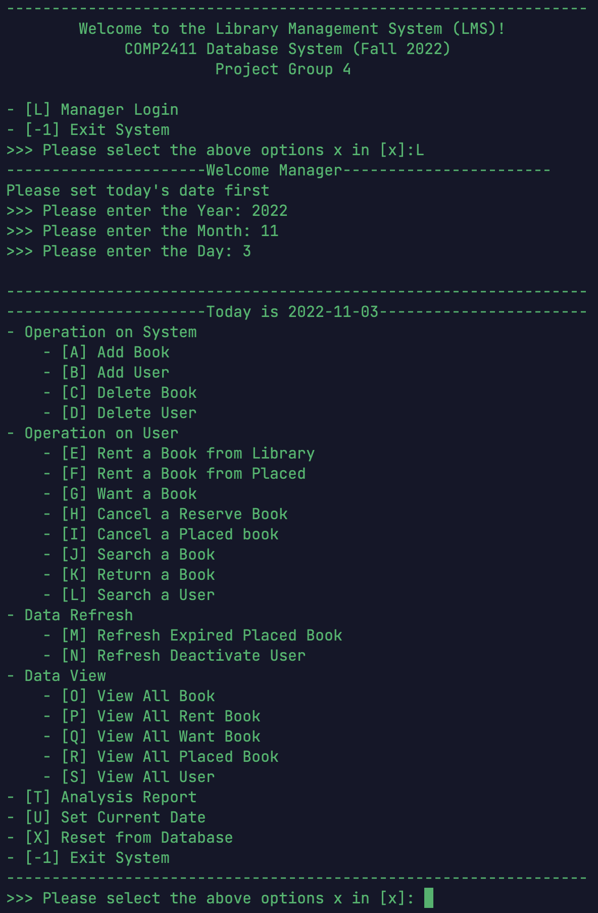

# Library Management System

> *A Group Project of Database Systems (COMP2411) subject at [The Hong Kong Polytechnic University](https://www.polyu.edu.hk/), made by [CHEN Derun](https://github.com/ShanpooO), [JIANG Guanlin](https://github.com/David200308), [KWOK Hin Chi](https://github.com/HaleyKwok), [LIU Minghao](https://github.com/David-Lmh), [YE Haowen](https://github.com/ShanYu0205), and [ZHANG Wengyu](https://github.com/zhangwengyu999), 2022-11-19*

## Group Members

- [CHEN Derun](https://github.com/ShanpooO) 
- [JIANG Guanlin](https://github.com/David200308) 
- [KWOK Hin Chi](https://github.com/HaleyKwok) 
- [LIU Minghao](https://github.com/David-Lmh)  
- [YE Haowen](https://github.com/ShanYu0205)   
- [ZHANG Wengyu](https://github.com/zhangwengyu999)

---

</img>

---

## Features

1. A book catalogue with search by name, author and category of the books.  Note there may  be more than one copy of each book, and a book may even be published by different  publishers. 
2. The ability to deactivate a patron’s account if he/she does not return books after a specific period of time passes. 
3. Records of books checked out as well as placed on hold (i.e. “reserved” by a patron to make sure the book is there when he/she gets to the library to check it out). 
4. Notifications when the desired book becomes available and reminders that a book should be returned to the library.  Both could be sent by email and/or when patron logs in to the LMS. 
5. Provide analysis report to management to review the system.

For detailed features, please refer to [Project Report](https://github.com/ShanpooO/Library_Management_System_Project/blob/main/Project_Report.pdf).

---

## User Guide

For detailed user guide, please refer to [User Guide](https://github.com/zhangwengyu999/Library_Management_System_Project/blob/main/User_Guide.pdf).

---

Copyright © [CHEN Derun](https://github.com/ShanpooO), [JIANG Guanlin](https://github.com/David200308), [KWOK Hin Chi](https://github.com/HaleyKwok), [LIU Minghao](https://github.com/David-Lmh), [YE Haowen](https://github.com/ShanYu0205), and [ZHANG Wengyu](https://github.com/zhangwengyu999) at [The Hong Kong Polytechnic University](https://www.polyu.edu.hk/). All rights reserved.
